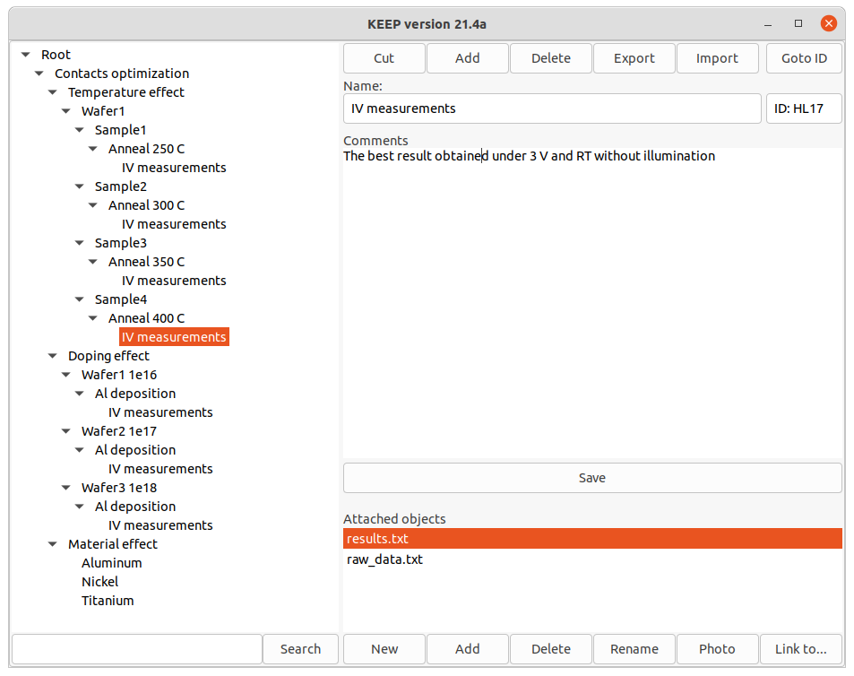

# wxKeeper

My first cross platform application written with wxWidgets

## Description

wxKeeper is multifunctional organizer. My primary aim was a developing of app which helps to organize scientific processes and studies. Each node may be presented as a process sequence starting from wafer and describing all treatments with the sample. In each stage an unique ID is assigned to the sample. This helps to identify an item.  

## Features
- Tree Import/Export
- fast context search
- right click menu
- files attachment
- web camera screenshots (only win version)

## Used language features
OOP, std algorithms, files IO.

## Dependencies
wxWidget library is used. For webcam support ffmpeg local server is used.